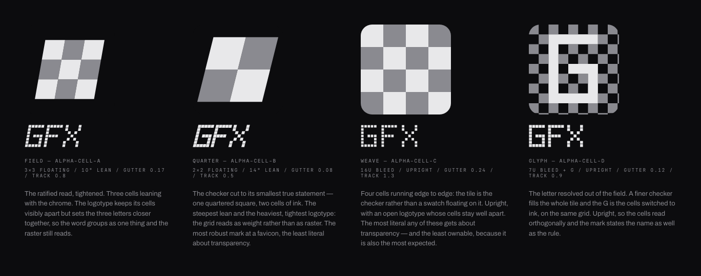

# The gfx.computer identity bundle

**Alpha cell is the ratified direction.** Transparency is the engine's binding
rule — an overlay renders to a cleared, premultiplied canvas — so the
transparency checkerboard is the identity and the letters are built from the
same cells. Deck Plate and Frame Mark were the other two directions explored in
the first cycle; they were not chosen and are gone.

Open now is which _variant_ of alpha cell ships. Four are drawn here. They differ
in cell count, lean, proportion, and how literally the grid reads in the type.
They do not differ in concept.

This folder is the review bundle, not the shipped identity. Nothing here is
wired into the app. Once a variant is approved, the install task
([dex `7f3otg8g`](../../.dex)) promotes its assets into `src/lib/assets/` and
`static/`, updates `DESIGN.md`, and deletes the variants that lost.

## What is fixed and what is open

Fixed by [`DESIGN.md`](../../DESIGN.md), and not up for discussion here: the
palette, the type scale, the density, the 2px/4px radii, and every editor
interaction. The identity uses chrome tokens only.

Also fixed now: the alpha-cell concept itself, and the fact that the family is
achromatic. The red display accent belonged to Deck Plate and went with it — no
variant here uses colour.

Open: which of the four variants becomes the gfx.computer logo.

## The four variants



Every variant ships a **mark** (a square tile for the favicon and app surfaces)
and a **logotype** (`GFX`). Both are drawn geometry — explicit SVG paths, no
typeset text — so a favicon or social card rasterizes identically with no font
available. All four letterforms sit on the same 5-by-7 cell module, so a change
of gutter or tracking never changes an advance width.

Two things separate the marks. A **floating** checker sets a block of cells
inside the tile, so the mark reads as a swatch laid on the deck. A **bleed**
checker runs the cells to the tile edge, so the tile _is_ the checker. A bleed
field is always upright: shearing it would slice the edge cells into slivers,
and a sliver appears and disappears with the rendered size.

Two things separate the logotypes. The **gutter** between cells is the weight
control — a small gutter fuses cells into heavy strokes, a large one leaves the
raster explicit. **Tracking** is how tightly the three letters group.

### Field — `alpha-cell-a`

3×3 floating, 10° lean, gutter 0.17, track 0.8.

The ratified read, tightened. Three cells leaning with the chrome. The logotype
keeps its cells visibly apart but sets the three letters closer together, so the
word groups as one thing and the raster still reads.

Pick this if the first cycle was already right and only wanted sharpening.

### Quarter — `alpha-cell-b`

2×2 floating, 14° lean, gutter 0.08, track 0.5.

The checker cut to its smallest true statement — one quartered square, two cells
of ink. The steepest lean and the heaviest, tightest logotype: the grid reads as
weight rather than as raster.

Pick this for the most robust mark at a favicon. It is also the least literal
about transparency — at two cells, a checker starts to read as a plain diagonal.

### Weave — `alpha-cell-c`

16u bleed, upright, gutter 0.24, track 1.3.

Four cells running edge to edge: the tile is the checker rather than a swatch
floating on it. Upright, with an open logotype whose cells stay well apart.

Pick this to be unmistakable about transparency. It is also the most expected
shape of the four, and the least ownable.

### Glyph — `alpha-cell-d`

7u bleed plus a resolved `G`, upright, gutter 0.12, track 0.9.

The letter resolved out of the field. A finer checker fills the whole tile and
the `G` is the cells switched to ink, on the same grid.

Pick this if the mark should state the name as well as the rule. It is the only
variant that still says "GFX" when it appears alone as an avatar.

## Every variant at every size

| Context                                                       | Field                                        | Quarter                                      | Weave                                        | Glyph                                        |
| ------------------------------------------------------------- | -------------------------------------------- | -------------------------------------------- | -------------------------------------------- | -------------------------------------------- |
| Favicon, true raster at 16/24/32/48px with a 6× magnification | [view](captures/favicon-alpha-cell-a.png)    | [view](captures/favicon-alpha-cell-b.png)    | [view](captures/favicon-alpha-cell-c.png)    | [view](captures/favicon-alpha-cell-d.png)    |
| Topbar, in the real 56px chrome                               | [view](captures/topbar-alpha-cell-a.png)     | [view](captures/topbar-alpha-cell-b.png)     | [view](captures/topbar-alpha-cell-c.png)     | [view](captures/topbar-alpha-cell-d.png)     |
| Home masthead                                                 | [view](captures/masthead-alpha-cell-a.png)   | [view](captures/masthead-alpha-cell-b.png)   | [view](captures/masthead-alpha-cell-c.png)   | [view](captures/masthead-alpha-cell-d.png)   |
| Social card, 1200×630                                         | [view](captures/social-alpha-cell-a.png)     | [view](captures/social-alpha-cell-b.png)     | [view](captures/social-alpha-cell-c.png)     | [view](captures/social-alpha-cell-d.png)     |
| Monochrome, one ink on deck and on paper                      | [view](captures/monochrome-alpha-cell-a.png) | [view](captures/monochrome-alpha-cell-b.png) | [view](captures/monochrome-alpha-cell-c.png) | [view](captures/monochrome-alpha-cell-d.png) |

The favicon sheets show the real 16px raster next to a 6× magnification of that
same raster, so a merged cell is visible rather than inferred.

## Proof

[`legibility-report.md`](legibility-report.md) is generated, not written. All
four variants pass every gate:

- The tightest cell stays at or above 1.5px at a 16px favicon.
- Ink coverage does not drift more than 0.08 from each mark's own 256px
  reference, so the form neither fills into a blob nor thins away.
- The number of separate ink regions and enclosed counters matches the reference
  at every size, so the cells stay apart and the counters stay open.
- Every sanctioned colour pairing clears WCAG — 4.5:1 for anything read as text,
  3:1 for non-text graphics — including both one-ink cuts on their worst-case
  backgrounds.

The margins differ, and the difference is real. Weave is effectively immune:
16-unit cells hold their coverage to within 0.003 at every size. Quarter is next
at 5.75px cells. Field sits at 3.5px and drifts 0.073 at 16px, just inside the
limit. Glyph has the smallest cells at 1.75px, but it is one connected letter
rather than loose cells, so it only drifts 0.067 — a resolved letter tolerates
scaling better than a scatter of cells the same size would.

## Use rules

These apply to whichever variant is ratified.

**Where each asset goes.** The mark alone is the favicon, the app icon, and any
avatar. The topbar takes the mark, the logotype, and the existing
`4K / WebGPU / alpha` spec plate — in that order, on one baseline. The masthead
and the social card take the mark, the logotype, and the address.

**The address.** `gfx.computer` sets in Paper Mono, muted, lowercase, at
0.18em tracking. It keeps its own case because it is a machine address, not a
plate label. The spec plate stays uppercase at 0.22em — the two are different
voices and must not be merged into one line.

**Colour.** Ink `#E8E8EA`, second checker neutral `#8A8A90`, plate `#0C0C0E`.
That is the whole palette. The family is achromatic: no accent, no gradient, and
never a Pack colour.

**Monochrome.** Every surface that cannot carry the plate uses the one-ink cut:
`#E8E8EA` on the deck, `#0C0C0E` on paper. The one-ink cut drops the second
neutral rather than flattening the checker into a solid block, so a floating
checker keeps its ink cells and a bleed field falls away to leave whatever ink
sits on it.

**Minimum sizes.** The mark is proven down to 16px. The logotype is proven down
to a 15px cap height, which is the size it sits at in the topbar capture. Below
those, use the mark alone.

**Clear space.** Keep clear space equal to a quarter of the mark's height on all
four sides. Nothing crosses it.

**Never.** Do not re-typeset the logotype in a font — it is drawn geometry, and
the paths are the asset. Do not rotate, stretch, outline, or re-space it. Do not
add a gradient, glow, or shadow. Do not place the mark on a coloured plate. Do
not shear a bleed field.

**Accessibility.** When the mark and the logotype appear together, the logotype
carries the accessible name `GFX` and the mark is decorative (`alt=""`). The
mark alone carries `GFX` itself.

## Regenerating

```
pnpm gen:identity     # redraw every candidate SVG from the geometry
pnpm verify:identity  # re-rasterize, re-measure, rewrite the captures and the report
```

Both commands prune what they no longer emit, so a retired variant cannot linger
in the bundle and be mistaken for a live option.

The geometry lives in
[`src/lib/identity/gfx-identity-geometry.ts`](../../src/lib/identity/gfx-identity-geometry.ts).
Change it there and re-run both commands — the SVGs and the captures are
generated output and hand-edits are lost.

## Ratification

**Approved direction:** alpha cell.
**Approved variant:** open — awaiting Scott's selection.

Approval means naming one variant id (`alpha-cell-a`, `alpha-cell-b`,
`alpha-cell-c`, or `alpha-cell-d`). Record it here, then run the install task,
which promotes that variant's six assets and removes the other three from this
folder.
