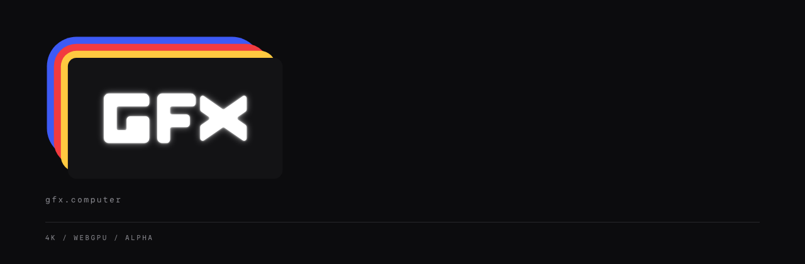

# The gfx.computer identity

**The Slate is the identity.** Scott ratified it on 2026-08-31 (dex bqkcgts5)
after rejecting a first round of candidates as derivative of their reference,
retiring the achromatic Quarter (`alpha-cell-b`, ratified 2026-08-28) the same
day. The direction is the early-broadcast **title card**: a stack of opaque
cards fans up-left behind a black top card carrying drawn extended
letterforms. Colour is a **luminance decay ramp** — the white face, then a
yellow, a red, and a blue echo, each one frame older — never a flat triad.
There are no scanlines, stripes, or discs anywhere in the family: the identity
borrows its era's title-card and stepped-echo vernacular, not the devices of
any existing mark. Scott killed the one-ink cuts at ratification — every
surface carries the full stack.



## The assets

`src/lib/assets/identity/` holds the four shipped files, generated by
`pnpm gen:identity` from
[`src/lib/identity/gfx-identity-geometry.ts`](../../src/lib/identity/gfx-identity-geometry.ts).
They are drawn geometry — explicit SVG paths, no typeset text — so a favicon or
a share card rasterizes identically with no font available.

| Asset                    | Use                                                                 |
| ------------------------ | ------------------------------------------------------------------- |
| `gfx-mark.svg`           | The G on its card stack: favicon, app icon, avatar, editor home link |
| `gfx-logotype.svg`       | The flat `GFX` line wherever the product names itself in chrome     |
| `gfx-title-card.svg`     | The GFX title card, flat — surfaces where bloom would be wrong      |
| `gfx-title-card-lit.svg` | The on-air cut: the masthead and the share card                     |

`static/gfx-social-card.png` is the 1200×630 share card, rendered from the same
geometry by `pnpm verify:identity`.

Hand-edits to any of these are lost: change the geometry module and re-run both
commands.

## Use rules

**Where each asset goes.** The mark alone is the favicon, the app icon, and any
avatar; in the editor it is also the link back to the library. The topbar takes
the mark and the flat logotype, in that order, on one baseline. The masthead
and the share card take the lit title card, the address, and the spec plate. No
app chrome carries the spec plate, and no app chrome carries the title card —
the card is a masthead and share surface only.

**One pixel for the mark.** Every chrome bar that shows the mark is 52px tall
and pads 12px, and the mark rides a 28px slot inside it, so it stands 15px from
the viewport edge on every route. Opening a composition from the listing must
not move it. The editor and the composition route render
[`GfxMarkHomeLink.svelte`](../../src/lib/identity/GfxMarkHomeLink.svelte), which
owns that slot; the listing topbar reproduces the same point.

**The address.** `gfx.computer` sets in Paper Mono, muted, lowercase, at
0.18em tracking. It keeps its own case because it is a machine address, not a
plate label. The spec plate stays uppercase at 0.22em — the two are different
voices and must not be merged into one line, and both are brand-sheet furniture
rather than chrome. Both strings live in
[`src/lib/identity/gfx-brand.ts`](../../src/lib/identity/gfx-brand.ts); the app
chrome and the capture sheets read them from there, so they can never drift
apart.

**Colour.** Face `#E8E8EA` (`#FFFFFF` only under bloom in the lit cut), decay
ramp `#FFC940` → `#F23B3F` → `#3D5AF5`, mark card `#0C0C0E`, title card
`#131315`. The ramp is ordered by falling luminance — each echo is one frame
older — and that order never changes. The decay colours belong to the identity
artwork only: they are never UI signals, never text, and never appear in chrome
outside the drawn assets.

**The fan.** The mark's fan is flat — every card at the top radius — because
the concentric roll reads swooshy below ~32px. The title card's fan is
concentric: a deeper card's radius grows by exactly its offset, so the colour
bands hold constant width around the corner. Neither card carries a keyline or
border: the title card separates from the deck by sitting one surface step
above it, the app's own elevation language.

**Bloom.** Bloom is an on-air dressing, never structure: it exists only in
`gfx-title-card-lit.svg`, only on the face, and the same geometry ships flat in
`gfx-title-card.svg`. Never add glow, shadow, or gradient to any other cut.

**Minimum sizes.** The mark is proven down to 16px. The flat logotype is proven
down to a 15px cap height, the size it sits at in the topbar. Below those, use
the mark alone. The title card has no small duty — it never renders below a
280px width.

**Clear space.** Keep clear space equal to a quarter of the top card's height
on all four sides of any cut. Nothing crosses it; the fan is part of the mark,
not clear space.

**Never.** Do not re-typeset the letterforms in a font — they are drawn
geometry, and the paths are the asset. Do not rotate, stretch, outline, or
re-space them. Do not recolour or reorder the decay ramp, add cards to the fan,
or put the fan on any other element. Do not place any cut on a coloured plate.

**Accessibility.** When the mark and the logotype appear together, the logotype
carries the accessible name `GFX` and the mark is decorative (`alt=""`). The
mark alone carries `GFX` itself; the title card carries `GFX` as its own name.

## Proof

[`legibility-report.md`](legibility-report.md) is generated, not written, and
the identity passes every gate:

- The tightest feature — the fan step, which equals the G's mouth — measures
  1.50px at a 16px favicon, on the resolvable floor exactly.
- Ink coverage does not drift more than 0.08 from the mark's own 256px
  reference, so the form neither fills into a blob nor thins away.
- The bright regions (the fan and the face) and enclosed counters match the
  reference at every size, so the stack stays readable and the G's mouth stays
  open.
- Every sanctioned colour pairing clears WCAG — 4.5:1 for anything read as
  text, 3:1 for non-text graphics — including every decay colour on the deck.

| Context                                                        | Capture                                  |
| -------------------------------------------------------------- | ---------------------------------------- |
| Favicon, true raster at 16/24/32/48px with a 6× magnification  | [view](captures/favicon.png)             |
| Topbar, in the real 52px chrome                                | [view](captures/topbar.png)              |
| Masthead: the lit title card, the address, the plate           | [view](captures/masthead.png)            |
| Share card, 1200×630                                           | [view](../../static/gfx-social-card.png) |

The favicon sheet shows the real 16px raster next to a 6× magnification of that
same raster, so a merged feature is visible rather than inferred.

## Regenerating

```
pnpm gen:identity     # redraw the shipped SVGs from the geometry
pnpm verify:identity  # re-rasterize, re-measure, rewrite the captures, the report, and the share card
```

Both commands prune what they no longer emit, so a retired asset cannot linger
and be mistaken for a live one — the Quarter's one-ink cuts were removed by
exactly this rule.
